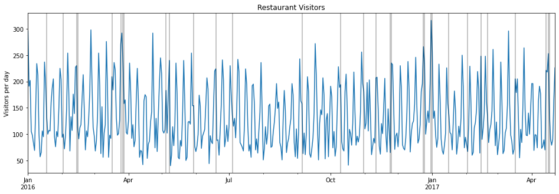

# Restaurant-Visitor-Forecasting

This is a Restaurant Visitors dataset that was inspired by a Kaggle competition. The data considers daily visitors to four restaurants located in the United States, subject to American holidays. 

The dataset contains 478 days of restaurant data, plus an additional 39 days of holiday data for forecasting purposes.

The data contains an exogenous variable: holiday, which we use to get additional information about the number of people visiting restaurants during particular seasons.

### Project Flow:

<ol>
 <li>Plotting the time series data and checking for spikes during holidays.</li>
 <li>ETS decomposition of time series data.</li>
 <li>Running ADF test to check stationarity.</li>
 <li>Running auto_arima from pmdarima to get recommended orders.</li>
 <li>Splitting data into training and testing sets.</li>
 <li>Fitting SARIMA model.</li>
 <li>Plotting predictions against known values.</li>
 <li>Model evaluation.</li>
 <li>Adding exogenous variable and ploting predictions on test data.</li>
 <li>Evaluating and comparing SARIMA model results with SARIMAX model results.</li>
 <li>Retraining with SARIMAX model and forecasting into the future.</li>
</ol>

### Plotting the data

The light gray lines mark occurrence of holidays.
As we can see here, generally, higher number of people visit retaurants on holidays.

 
