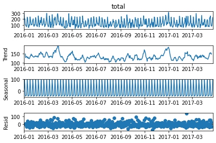
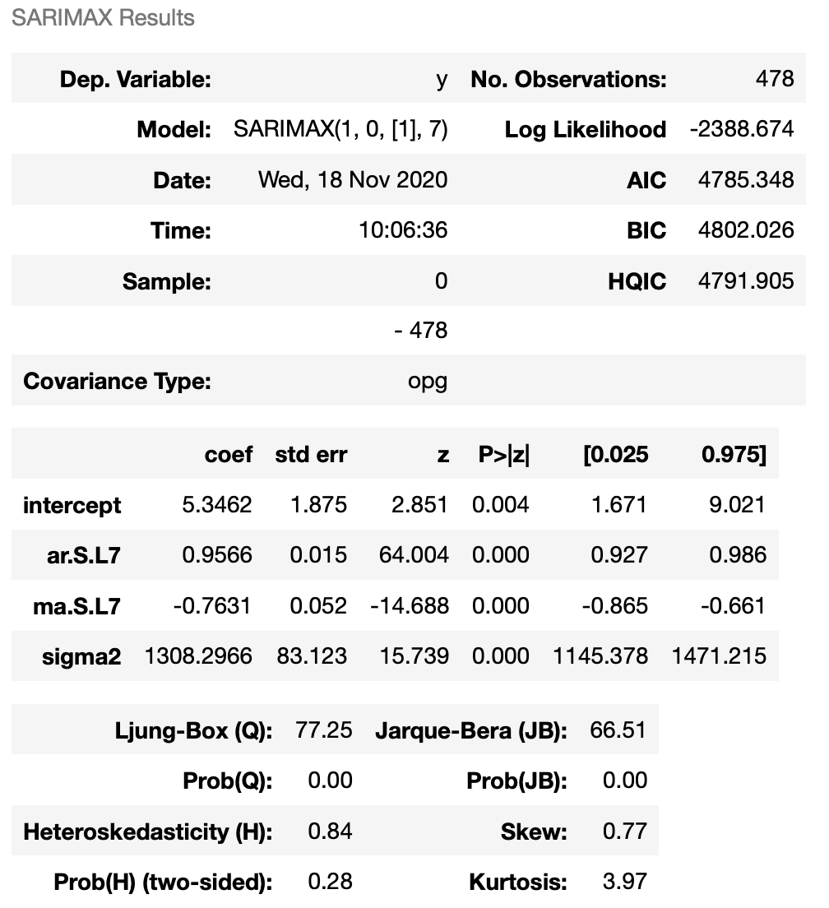
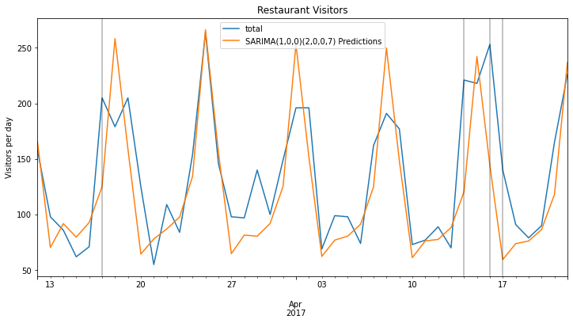
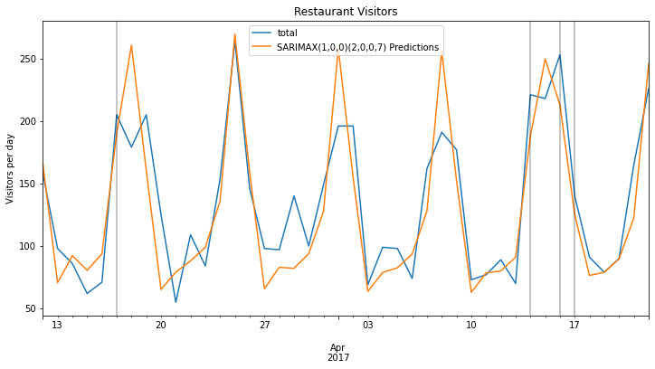
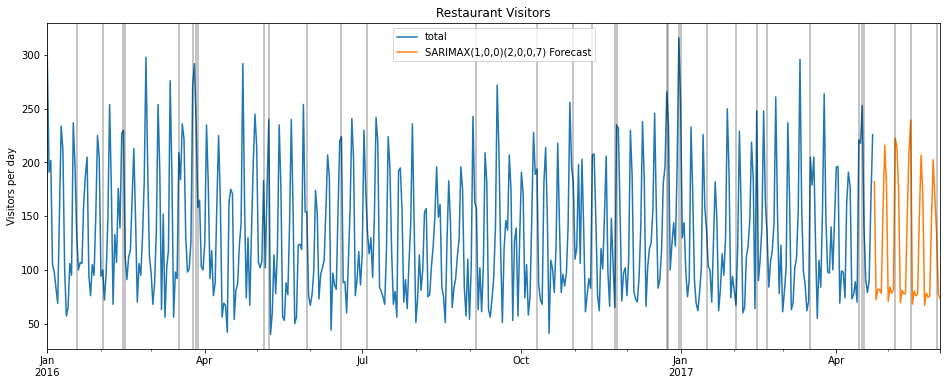

# Restaurant-Visitor-Forecasting

This is a Restaurant Visitors dataset that was inspired by a Kaggle competition. The data considers daily visitors to four restaurants located in the United States, subject to American holidays. 

The dataset contains 478 days of restaurant data, plus an additional 39 days of holiday data for forecasting purposes.

The data contains an exogenous variable: holiday, which we use to get additional information about the number of people visiting restaurants during particular seasons.

### Project Flow:

<ol>
 <li>Plotting the time series data and checking for spikes during holidays.</li>
 <li>ETS decomposition of time series data.</li>
 <li>Running ADF test to check stationarity.</li>
 <li>Running auto_arima from pmdarima to get recommended orders.</li>
 <li>Splitting data into training and testing sets.</li>
 <li>Fitting SARIMA model and plotting predictions against known values.</li>
 <li>Model evaluation.</li>
 <li>Adding exogenous variable and ploting predictions on test data.</li>
 <li>Evaluating and comparing SARIMA model results with SARIMAX model results.</li>
 <li>Retraining with SARIMAX model and forecasting into the future.</li>
</ol>

### Plotting the data

The light gray lines mark occurrence of holidays.
As we can see here, generally, higher number of people visit retaurants on holidays.

### ETS decomposition

We can see here that a significant amount of seasonality is present in the data.

### ADF Test

From the ADF test, we can conclude that the data is stationary.

### Running auto_arima

This provides an ARIMA Order of (1,0,0) and a seasonal order of (2,0,0,7)

### Splitting into training and testing sets

Total length of dataset is 478 rows.
We'll assign 42 days (6 weeks) to the test set so that it includes several holidays.

Therefore, len(train) = 436; len(test) = 42

### Fitting SARIMA model and plotting predictions on test set

### Model evaluation 

SARIMA(1,0,0)(2,0,0,7) -> MSE Error: 1702.629477
 
SARIMA(1,0,0)(2,0,0,7) -> RMSE Error: 41.26293103

### Adding holiday variable; training SARIMAX model and plotting predictions on test data

### Evaluating and comparing SARIMA model results with SARIMAX model results

SARIMA(1,0,0)(2,0,0,7) MSE Error: 1702.629477
 
SARIMA(1,0,0)(2,0,0,7) RMSE Error: 41.26293103
 
SARIMAX(1,0,0)(2,0,0,7) MSE Error: 965.5702335
 
SARIMAX(1,0,0)(2,0,0,7) RMSE Error: 31.07362601
 

As we can see, SARIMAX performed better than SARIMA model because of additional information about the holiday variable, which indicates spikes in the number of visitors in restaurants.

### Retraining with SARIMAX model and forecasting into the future

 
